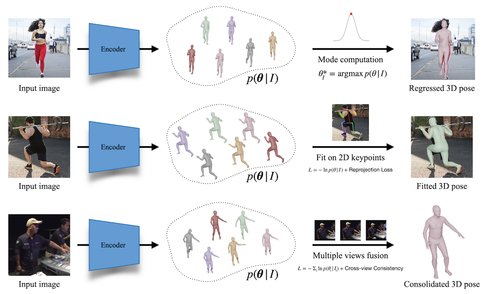

# ProHMR - Probabilistic Modeling for Human Mesh Recovery
Code repository for the paper:  
**Probabilistic Modeling for Human Mesh Recovery**  
[Nikos Kolotouros](https://www.seas.upenn.edu/~nkolot/), [Georgios Pavlakos](https://geopavlakos.github.io/), [Dinesh Jayaraman](http://www.seas.upenn.edu/~dineshj), [Kostas Daniilidis](http://www.cis.upenn.edu/~kostas/)  
ICCV 2021  
[[paper]()] [[project page](https://www.seas.upenn.edu/~nkolot/projects/prohmr/)]



## Installation instructions
We recommend creating a clean [conda](https://docs.conda.io/) environment and install all dependencies.
You can do this as follows:
```
conda env create -f environment.yml
```

After the installation is complete you can activate the conda environment by running:
```
conda activate prohmr
```

Alternatively, you can also create a virtual environment:
```
python -m venv .prohmr_venv
source .prohmr_venv/bin/activate
pip install -r requirements.txt
```

The last step is to install prohmr as a Python package. This will allow you to import it from anywhere in your system.
Since you might want to modify the code, we recommend installing as follows:
```
python setup.py develop
```

In case you want to evaluate our approach on Human3.6M, you also need to manually install the [pycdf package of the spacepy library](https://pythonhosted.org/SpacePy/pycdf.html) to process some of the original files. If you face difficulties with the installation, you can find more elaborate instructions [here](https://stackoverflow.com/questions/37232008/how-read-common-data-formatcdf-in-python).

## Fetch data
Download the pretrained model checkpoint together with some additional data (joint regressors, etc.) and place them under `data/`.
We provide a script to fetch the necessary data for training and evaluation. You need to run:
```
./fetch_data.sh
```
Besides these files, you also need to download the *SMPL* model. You will need the [neutral model](http://smplify.is.tue.mpg.de) for training and running the demo code, while the [male and female models](http://smpl.is.tue.mpg.de) will be necessary for preprocessing the 3DPW dataset. Please go to the websites for the corresponding projects and register to get access to the downloads section. Create a folder `data/smpl/` and place the models there.

## Run demo code
The easiest way to try our demo is by providing images with their corresponding [OpenPose](https://github.com/CMU-Perceptual-Computing-Lab/openpose) detections. These are used to compute the bounding boxes around the humans and optionally fit the SMPL body model to the keypoint detections. We provide some example images in the `example_data/` folder.
You can test our network on these examples by running:
```
python demo.py --img_folder=example_data/images --keypoint_folder=example_data/keypoints --out_folder=out --run_fitting
```
You might see some warnings about missing keys for SMPL components, which you can ignore.
The code will save the rendered results for the regression and fitting in the newly created `out/` directory.
By default the demo code performs the fitting in the image crop and not in the original image space.
If you want to instead fit in the original image space you can pass the `--full_frame` flag.

## Colab Notebook
We also provide a Colab Notebook [here](https://colab.research.google.com/drive/1ivLN2TSL08RgWO49qZWFiDNzImIAhGzb?usp=sharing) where you can test our method on videos from YouTube.
Check it out!

## Dataset preprocessing
Besides the demo code, we also provide code to train and evaluate our models on the datasets we employ for our empirical evaluation. Before continuing, please make sure that you follow the [details for data preprocessing](dataset_preprocessing/README.md).

## Run evaluation code
The evaluation code is contained in `eval/`. We provide 4 different evaluation scripts.
- `eval_regression.py` is used to evaluate ProHMR as a regression model as in Table 1 of the paper.
- `eval_keypoint_fitting.py` is used to evaluate the fitting on 2D keypoints as in Table 3 of the paper.
- `eval_multiview.py` is used to evaluate the multi-view refinement as in Table 5 of the paper.
- `eval_skeleton.py` is used to evaluate the probablistic 2D pose lifiting network similarly with Table 6 of the main paper.
Example usage:
```
python eval/eval_keypoint_fitting.py --dataset=3DPW-TEST
```
Running the above command will compute the Reconstruction Error before and after the fitting on the test set of 3DPW. For more information on the available command line options you can run the command with the `--help` argument.

## Run training code
Due to license limitiations, we cannot provide the SMPL parameters for Human3.6M (recovered using [MoSh](http://mosh.is.tue.mpg.de)). Even if you do not have access to these parameters, you can still use our training code using data from the other datasets. Again, make sure that you follow the [details for data preprocessing](datasets/preprocess/README.md). Alternatively you can use the [SMPLify 3D fitting code](https://github.com/JiangWenPL/multiperson) to generate SMPL parameter annotations by fitting the model to the 3D keypoints provided by the dataset.
Example usage:
```
python train/train_prohmr.py --root_dir=prohmr_reproduce/
```
This will train the model using the default config file `prohmr/configs/prohmr.yaml` as described in the paper. It will also create the folders `prohmr_reproduce/checkpoints` and `prohmr_reproduce/tensorboard` where the model checkpoints and Tensorboard logs will be saved.

We also provide the training code for the probabilistic version of Martinez _et al._ We are not allowed to redistribute the Stacked Hourglass keypoint detections used in training the model in the paper, so in this version of the code we replace them with the ground truth 2D keypoints of the dataset.
You can train the skeleton model by running:
```
python train/train_skeleton.py --root_dir=skeleton_lifting/
```
Running this script will produce a similar output with the ProHMR training script.

## Acknowledgements
Parts of the code are taken or adapted from the following repos:
- [SPIN](https://github.com/nkolot/SPIN)
- [SMPLify-X](https://github.com/vchoutas/smplify-x)
- [HMR](https://github.com/akanazawa/hmr)
- [Epipolar Pose](https://github.com/mkocabas/EpipolarPose)
- [OpenPose](https://github.com/CMU-Perceptual-Computing-Lab/openpose)
- [nflows](https://github.com/nkolot/nflows) forked from [the original implementation](https://github.com/bayesiains/nflows)

## Citing
If you find this code useful for your research or the use data generated by our method, please consider citing the following paper:

	@Inproceedings{kolotouros2021prohmr,
	  Title          = {Probabilistic Modeling for Human Mesh Recovery},
	  Author         = {Kolotouros, Nikos and Pavlakos, Georgios and Jayaraman, Dinesh and Daniilidis, Kostas},
	  Booktitle      = {ICCV},
	  Year           = {2021}
	}
